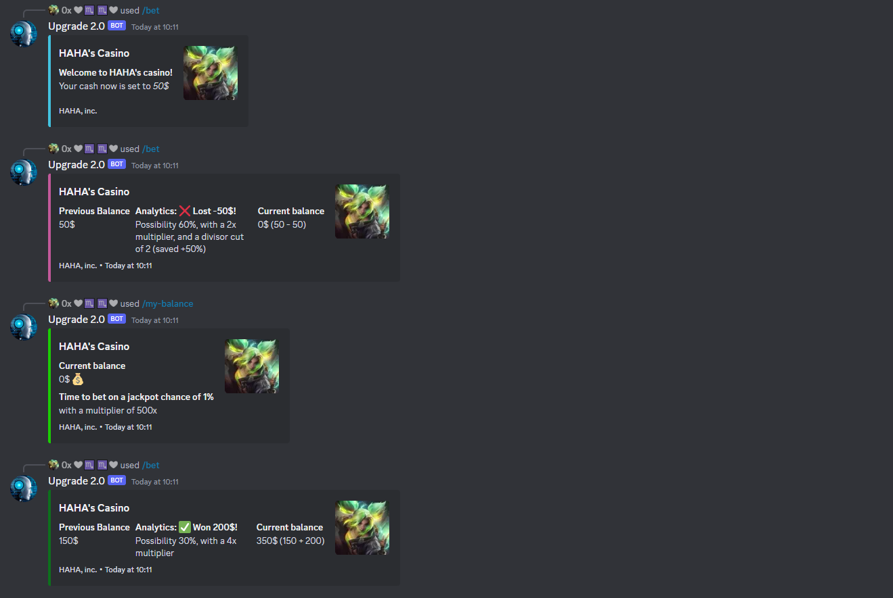

# Upgrade 2.0 

## Description
Introducing "Upgrade 2.0" - a versatile Discord bot designed to enhance your gaming experience! Upgrade 2.0 utilizes Riot Games' API to fetch your in-game masteries, account information, and even entertaining champion quotes. Whether you're curious about your performance or seeking some fun at the casino, Upgrade 2.0 has you covered. Engage with your fellow summoners, discuss strategies, and try your luck with various casino games, all in one convenient Discord bot. Get ready to level up your Discord server with Upgrade 2.0! 🎮🤖

## Commands

## League of legends related

### /get-info [summonerName] [server]
* Get quick access to your account information, including your summoner name, level, server, elo and top 3 champions.

### /mastery-gg [summonerName] [server]
* Use this command to retrieve your in-game masteries and champion performance statistics.

### /champ quote [champion]
* Unleash the fun with this command, which fetches entertaining quotes from various champions in the game.

_With these commands, Upgrade 2.0 will be your trusted companion in your gaming adventures on Discord!_ 🎮🤖

## Casino Related

### /bet [amount]
* Use this command to place a bet of the specified amount in the casino games.

### /my-balance
* Check your current balance to keep track of your winnings or losses in the casino.

### /casino-reset
* Reset your casino balance to start fresh and try your luck again.

_With these commands, you can have some thrilling fun and keep a close eye on your virtual fortune! Good luck and enjoy the games!_ 🎲🤑

## How to get started

**Configure the ***.env*** file accordingly**  
**npm install** - to install the required dependencies  
**npm run start** - start the application

                                                                            